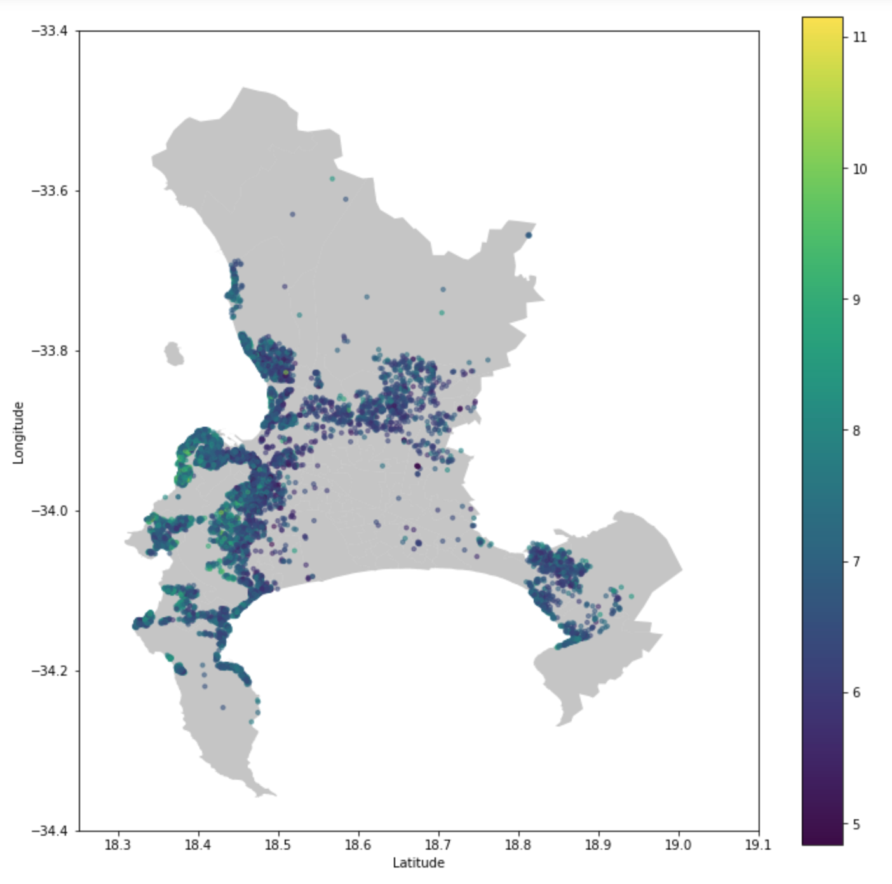

# Modelling AirBnb Price in Cape Town

This notebook provides an investigation into the factors influencing AirBnB price in Cape Town. AirBnB price is modelled using a linear regression model under OLS assumptions. 

Several models obtained through forward subset selection and LASSO procedures are compared with the final model selected according to model selection methods and domain knowledge. 
Inference is then performed on final model and hypothesis tests are performed to determine whether the selected variables are significant.

## Analysis

- To select a suitable subset ofvariables from the available predictors, model selection was performed using LASSO and forward stepwiseregression techniques.
- The final model was then selected according to the Akaike's Information Criterion together with insights extracted through the data exploration procedure.
- Lastly, the selected model was refitted on the inference set and the statistical significance of each included variable was determined.
- To account for the effects of multiple testing, Bonferroni's Procedure was utilised to control the amount of false positives.
- The final model after exclusion of insignificant variables was then refitted on the inference set to obtain the final coefficient estimates.
